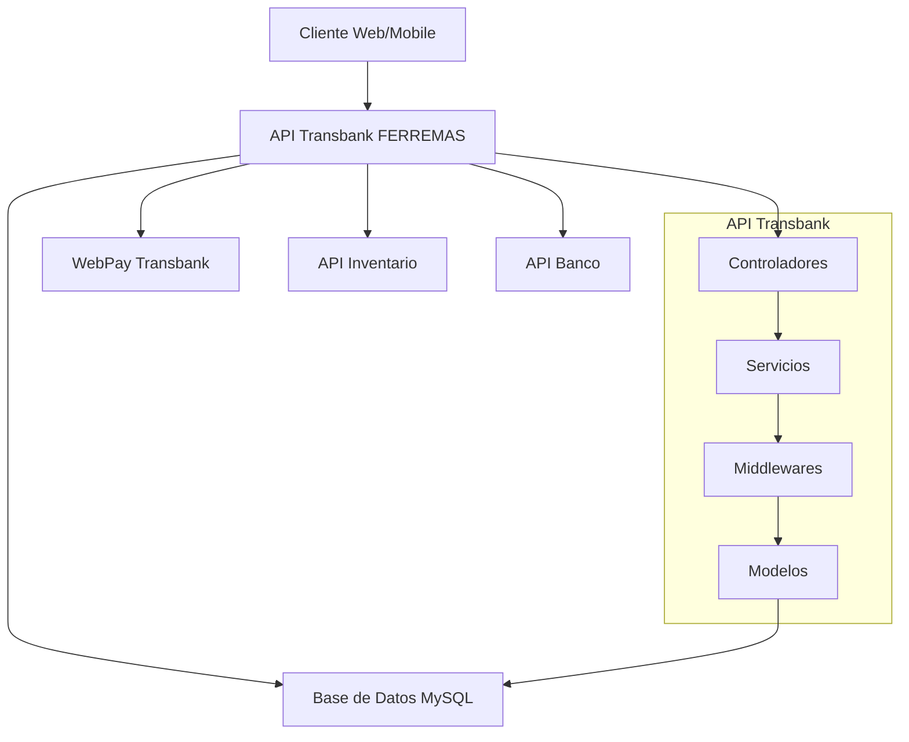

# Api-Transbank
# 🏪 API Transbank FERREMAS

<p align="center">
  
  
  
  
</p>

API completa de integración con **Transbank WebPay** para el sistema FERREMAS. Esta API maneja el procesamiento de pagos mediante WebPay, se integra con las APIs de Inventario y Banco, y proporciona un sistema completo de gestión de transacciones.

## 📋 Tabla de Contenidos

- [🏪 API Transbank FERREMAS](#-api-transbank-ferremas)
  - [📋 Tabla de Contenidos](#-tabla-de-contenidos)
  - [🚀 Características Principales](#-características-principales)
  - [🏗️ Arquitectura del Sistema](#️-arquitectura-del-sistema)
  - [📊 Base de Datos](#-base-de-datos)
  - [⚙️ Instalación](#️-instalación)
    - [📋 Prerrequisitos](#-prerrequisitos)
    - [🔧 Configuración Paso a Paso](#-configuración-paso-a-paso)
  - [🌐 Endpoints Principales](#-endpoints-principales)
  - [💡 Ejemplos de Uso](#-ejemplos-de-uso)
    - [1. Flujo Completo de Pago](#1-flujo-completo-de-pago)
    - [2. Gestión de Comercios](#2-gestión-de-comercios)
  - [🔗 Integración con Otras APIs](#-integración-con-otras-apis)
    - [API de Inventario](#api-de-inventario)
    - [API de Banco](#api-de-banco)
  - [📝 Logging y Monitoreo](#-logging-y-monitoreo)
  - [🧪 Testing](#-testing)
  - [🐳 Docker](#-docker)
  - [📚 Documentación Adicional](#-documentación-adicional)
  - [🛡️ Seguridad](#️-seguridad)
  - [🤝 Contribuir](#-contribuir)
  - [📄 Licencia](#-licencia)

## 🚀 Características Principales

- ✅ **Integración completa con WebPay**: Soporte para transacciones de débito y crédito
- ✅ **Gestión de comercios**: Múltiples comercios con configuraciones independientes
- ✅ **Logs detallados**: Sistema completo de auditoría y trazabilidad
- ✅ **Estados de transacción**: Seguimiento completo del ciclo de vida
- ✅ **Configuraciones dinámicas**: Sistema flexible de configuración
- ✅ **Health checks**: Monitoreo del estado de la API y sus dependencias
- ✅ **Rate limiting**: Protección contra abuso y spam
- ✅ **Validaciones robustas**: Validación completa de datos de entrada
- ✅ **Integración con inventario**: Verificación de stock en tiempo real
- ✅ **Integración bancaria**: Registro automático de pagos

## 🏗️ Arquitectura del Sistema



## 📊 Base de Datos

La API utiliza **6 tablas principales** para gestionar todas las operaciones:

| Tabla | Descripción | Relaciones |
|-------|-------------|------------|
| `transbank_comercios` | Información de comercios registrados | 1:N con transacciones |
| `transbank_transacciones` | Registro de todas las transacciones | N:1 con comercios |
| `transbank_detalles_transaccion` | Detalles específicos de WebPay | 1:1 con transacciones |
| `transbank_estados_transaccion` | Historial de cambios de estado | N:1 con transacciones |
| `transbank_configuraciones` | Configuraciones del sistema | - |
| `transbank_logs` | Logs detallados del sistema | N:1 con transacciones |

## ⚙️ Instalación

### 📋 Prerrequisitos

- **Node.js** v18.x o superior
- **MySQL** v8.x o superior
- **NPM** v8.x o superior
- **APIs FERREMAS** (Inventario y Banco) corriendo

### 🔧 Configuración Paso a Paso

1. **Clonar el repositorio**
   ```bash
   git clone https://github.com/AndreaSantanaCea1999/api-transbank-ferremas.git
   cd api-transbank-ferremas
   ```

2. **Instalar dependencias**
   ```bash
   npm install
   ```

3. **Configurar variables de entorno**
   ```bash
   cp .env.example .env
   # Editar .env con tus configuraciones
   ```

4. **Configurar base de datos**
   ```bash
   # Crear base de datos
   mysql -u root -p -e "CREATE DATABASE ferremas_complete;"
   
   # Ejecutar script de creación de tablas
   mysql -u administrador -p ferremas_complete < database/create_transbank_tables.sql
   ```

5. **Verificar instalación**
   ```bash
   npm run verify-db
   ```

6. **Inicializar datos**
   ```bash
   node src/utils/init-transbank.js
   ```

7. **Iniciar la API**
   ```bash
   # Desarrollo
   npm run dev
   
   # Producción
   npm start
   ```

8. **Verificar funcionamiento**
   ```bash
   curl http://localhost:3002/api/health
   ```

## 🌐 Endpoints Principales

### 💳 Transbank - Operaciones Principales

| Método | Endpoint | Descripción |
|--------|----------|-------------|
| `POST` | `/api/transbank/iniciar` | Iniciar nueva transacción |
| `POST` | `/api/transbank/confirmar` | Confirmar transacción |
| `GET` | `/api/transbank/estado/:token` | Consultar estado |
| `POST` | `/api/transbank/anular/:token` | Anular transacción |
| `POST` | `/api/transbank/webhook` | Webhook notificaciones |

### 🏪 Gestión de Comercios

| Método | Endpoint | Descripción |
|--------|----------|-------------|
| `GET` | `/api/comercios` | Listar comercios |
| `POST` | `/api/comercios` | Crear comercio |
| `GET` | `/api/comercios/:id` | Obtener comercio |
| `PUT` | `/api/comercios/:id` | Actualizar comercio |
| `PATCH` | `/api/comercios/:id/estado` | Cambiar estado |

### 📊 Consultas y Reportes

| Método | Endpoint | Descripción |
|--------|----------|-------------|
| `GET` | `/api/transacciones` | Listar transacciones |
| `GET` | `/api/transacciones/:id` | Obtener transacción |
| `GET` | `/api/transacciones/estado/:estado` | Por estado |
| `GET` | `/api/transacciones/reportes/resumen` | Resumen |

### 🔍 Health & Monitoring

| Método | Endpoint | Descripción |
|--------|----------|-------------|
| `GET` | `/api/health` | Estado general |
| `GET` | `/api/health/database` | Estado BD |
| `GET` | `/api/health/integrations` | Estado APIs |
| `GET` | `/api/logs` | Logs del sistema |

## 💡 Ejemplos de Uso

### 1. Flujo Completo de Pago

```javascript
// 1. Iniciar transacción
const transaccion = await fetch('http://localhost:3002/api/transbank/iniciar', {
  method: 'POST',
  headers: { 'Content-Type': 'application/json' },
  body: JSON.stringify({
    idPedido: 12345,
    idCliente: 1,
    monto: 50000,
    codigoComercio: "597055555532",
    descripcion: "Compra herramientas",
    items: [
      { idProducto: 101, cantidad: 2, idSucursal: 1 }
    ]
  })
});

const { data } = await transaccion.json();
console.log('Token:', data.token);
console.log('URL WebPay:', data.url);

// 2. Redirigir usuario a WebPay
window.location.href = data.url;

// 3. Después del pago, confirmar transacción
const confirmacion = await fetch('http://localhost:3002/api/transbank/confirmar', {
  method: 'POST',
  headers: { 'Content-Type': 'application/json' },
  body: JSON.stringify({
    token_ws: data.token
  })
});

const resultado = await confirmacion.json();
console.log('Estado:', resultado.data.estado);
console.log('Código autorización:', resultado.data.codigoAutorizacion);
```

### 2. Gestión de Comercios

```javascript
// Crear nuevo comercio
const comercio = await fetch('http://localhost:3002/api/comercios', {
  method: 'POST',
  headers: { 'Content-Type': 'application/json' },
  body: JSON.stringify({
    Codigo_Comercio: "597055555533",
    Nombre_Comercio: "FERREMAS SUCURSAL NORTE",
    Rut_Comercio: "98765432-1",
    API_Key: "597055555533",
    API_Secret: "mi_secret_seguro",
    Ambiente: "INTEGRACION"
  })
});

// Listar transacciones de un comercio
const transacciones = await fetch(
  'http://localhost:3002/api/comercios/1/transacciones?estado=APROBADA'
);
```

## 🔗 Integración con Otras APIs

### API de Inventario
```bash
# Variable de entorno
API_INVENTARIO_URL=http://localhost:3000/api

# Endpoints utilizados:
# GET /inventario/producto/{id}/sucursal/{sucursal}
# PATCH /pedidos/{id}/estado
```

### API de Banco
```bash
# Variable de entorno  
API_BANCO_URL=http://localhost:3001/api

# Endpoints utilizados:
# POST /pagos
# POST /webpay
# GET /clientes/{id}
```

## 📝 Logging y Monitoreo

La API incluye un sistema completo de logging:

```javascript
// Logs automáticos en base de datos
GET /api/logs?nivel=ERROR&page=1&limit=50

// Logs por transacción específica
GET /api/logs/transaccion/123

// Limpiar logs antiguos
POST /api/logs/limpiar
{
  "diasAntiguedad": 30
}
```

**Niveles de log disponibles:**
- `DEBUG`: Información detallada para desarrollo
- `INFO`: Información general del sistema
- `WARN`: Advertencias que no detienen el flujo
- `ERROR`: Errores que requieren atención
- `FATAL`: Errores críticos del sistema

## 🧪 Testing

```bash
# Ejecutar todos los tests
npm test

# Tests en modo watch  
npm run test:watch

# Generar reporte de cobertura
npm run test:coverage

# Tests de integración
npm run test:integration
```

**Estructura de tests:**
```
tests/
├── unit/           # Tests unitarios
├── integration/    # Tests de integración
└── e2e/           # Tests end-to-end
```

## 🐳 Docker

```bash
# Construir imagen
docker build -t api-transbank-ferremas .

# Ejecutar con Docker Compose
docker-compose up -d

# Ver logs
docker-compose logs -f api-transbank
```

**docker-compose.yml incluye:**
- API Transbank
- Base de datos MySQL
- Volúmenes persistentes
- Red interna para las APIs

## 📚 Documentación Adicional

- **Postman Collection**: Importar `docs/postman/API_Transbank_FERREMAS.json`
- **OpenAPI/Swagger**: Disponible en `/api-docs` cuando está ejecutándose
- **Diagramas de arquitectura**: Carpeta `docs/diagrams/`
- **Manual de integración**: `docs/integration-guide.md`

## 🛡️ Seguridad

### Medidas Implementadas:
- ✅ **Rate Limiting**: Límites por IP y endpoint
- ✅ **Validación de entrada**: Validación estricta con Joi
- ✅ **Headers de seguridad**: Helmet.js configurado
- ✅ **Logs de seguridad**: Auditoría completa
- ✅ **Encriptación**: Datos sensibles encriptados
- ✅ **CORS**: Configurado para dominios específicos

### Recomendaciones:
- Usar HTTPS en producción
- Configurar firewall para base de datos
- Rotar claves API regularmente
- Monitorear logs de seguridad

## 🤝 Contribuir

1. Fork del repositorio
2. Crear rama para feature: `git checkout -b feature/nueva-funcionalidad`
3. Commit cambios: `git commit -am 'Agregar nueva funcionalidad'`
4. Push a la rama: `git push origin feature/nueva-funcionalidad`
5. Crear Pull Request

### Estándares de código:
- ESLint configurado
- Prettier para formateo
- Conventional Commits
- Tests para nuevas funcionalidades

## 📄 Licencia

MIT License - ver archivo `LICENSE` para detalles.

---

## 🚨 Solución de Problemas

### Error: "Cannot connect to MySQL"
```bash
# Verificar que MySQL esté corriendo
sudo systemctl status mysql

# Verificar credenciales en .env
mysql -u administrador -p -e "SHOW DATABASES;"
```

### Error: "API de inventario no responde"
```bash
# Verificar que la API de inventario esté corriendo
curl http://localhost:3000/api/health

# Verificar URL en .env
API_INVENTARIO_URL=http://localhost:3000/api
```

### Error: "Rate limit exceeded"
```bash
# Ajustar límites en .env
RATE_LIMIT_WINDOW_MS=900000
RATE_LIMIT_MAX=100
```

---

<p align="center">
  <strong>🏪 API Transbank FERREMAS - Sistema completo de pagos integrado</strong><br>
  Desarrollado con ❤️ para FERREMAS
</p>
