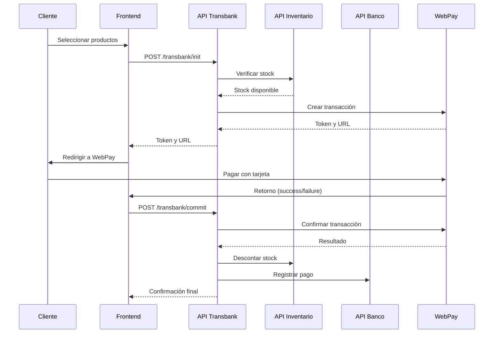

# 🏦 API Transbank FERREMAS

[](https://nodejs.org/)
[](https://expressjs.com/)
[](https://mysql.com/)
[](https://transbank.cl/)

**API especializada para la integración con WebPay de Transbank** - Tercera API del ecosistema FERREMAS que maneja todos los pagos electrónicos y transacciones de comercio electrónico.

## ✨ Características Principales

- 🔐 **Integración Segura con WebPay**: Implementación completa del protocolo WebPay Plus
- 💳 **Gestión de Transacciones**: Ciclo completo desde inicio hasta confirmación
- 🔄 **Sincronización Multi-API**: Integración con APIs de Inventario y Banco
- 📊 **Auditoría Completa**: Logs detallados de todas las operaciones
- 🛡️ **Seguridad Avanzada**: Rate limiting, validaciones y encriptación
- 🌐 **Modo Dual**: Integración (pruebas) y Producción
- 📈 **Monitoreo en Tiempo Real**: Estadísticas y dashboards
- 🔁 **Gestión de Devoluciones**: Sistema completo de reembolsos

## 🏗️ Arquitectura del Sistema

```
┌─────────────────┐    ┌─────────────────┐    ┌─────────────────┐
│   FRONTEND      │    │  API TRANSBANK  │    │   TRANSBANK     │
│   (Angular)     │◄──►│   (Puerto 3002) │◄──►│   WEBPAY        │
└─────────────────┘    └─────────────────┘    └─────────────────┘
                                │
                    ┌───────────┼───────────┐
                    ▼           ▼           ▼
            ┌──────────────┐ ┌─────────┐ ┌──────────────┐
            │API INVENTARIO│ │  MySQL  │ │  API BANCO   │
            │(Puerto 3000) │ │   DB    │ │(Puerto 3001) │
            └──────────────┘ └─────────┘ └──────────────┘
```

## 📋 Tabla de Contenidos

1. [🚀 Instalación Rápida](#-instalación-rápida)
2. [⚙️ Configuración](#️-configuración)
3. [📚 Documentación de API](#-documentación-de-api)
4. [🔗 Integración con Otras APIs](#-integración-con-otras-apis)
5. [💡 Ejemplos de Uso](#-ejemplos-de-uso)
6. [🧪 Pruebas](#-pruebas)
7. [🚀 Despliegue](#-despliegue)
8. [🛠️ Desarrollo](#️-desarrollo)

## 🚀 Instalación Rápida

### Prerrequisitos

- ✅ Node.js 18.x o superior
- ✅ MySQL 8.x
- ✅ APIs de Inventario y Banco funcionando
- ✅ Credenciales de Transbank (integración o producción)

### Instalación

```bash
# 1. Clonar el repositorio
git clone https://github.com/AndreaSantanaCea1999/api-transbank-ferremas.git
cd api-transbank-ferremas

# 2. Instalar dependencias
npm install

# 3. Configurar variables de entorno
cp .env.example .env
nano .env  # Editar con tus credenciales

# 4. Crear tablas en la base de datos
mysql -u root -p ferremas_complete < database/transbank-schema.sql

# 5. Verificar configuración
npm run verify

# 6. Insertar datos de prueba (opcional)
npm run seed

# 7. Iniciar en modo desarrollo
npm run dev
```

### Verificación de Instalación

```bash
# Verificar que la API está funcionando
curl http://localhost:3002/api/health

# Respuesta esperada:
{
  "status": "OK",
  "timestamp": "2024-01-15T10:30:00.000Z",
  "uptime": 125.432,
  "environment": "development",
  "version": "1.0.0"
}
```

## ⚙️ Configuración

### Variables de Entorno Principales

```bash
# Servidor
NODE_ENV=development
PORT=3002

# Base de Datos
DB_HOST=localhost
DB_USER=administrador
DB_PASSWORD=yR!9uL2@pX
DB_NAME=ferremas_complete

# Transbank
TRANSBANK_ENVIRONMENT=integration
TRANSBANK_COMMERCE_CODE=597055555532
TRANSBANK_API_KEY=579B532A7440BB0C9079DED94D31EA1615BACEB56610332264630D42D0A36B1C

# Integración APIs
API_INVENTARIO_URL=http://localhost:3000/api
API_BANCO_URL=http://localhost:3001/api

# URLs Frontend
FRONTEND_BASE_URL=http://localhost:4200
WEBPAY_RETURN_URL=http://localhost:4200/payment/return
WEBPAY_FINAL_URL=http://localhost:4200/payment/final
```

### Configuración de Transbank

#### Modo Integración (Pruebas)
```bash
TRANSBANK_ENVIRONMENT=integration
TRANSBANK_COMMERCE_CODE=597055555532
TRANSBANK_API_KEY=579B532A7440BB0C9079DED94D31EA1615BACEB56610332264630D42D0A36B1C
```

#### Modo Producción
```bash
TRANSBANK_ENVIRONMENT=production
TRANSBANK_COMMERCE_CODE=tu_codigo_comercio_real
TRANSBANK_API_KEY=tu_api_key_produccion
```

## 📚 Documentación de API

### Endpoints Principales

#### 🚀 Iniciar Transacción
```http
POST /api/transbank/init
Content-Type: application/json

{
  "monto": 75000,
  "productos": [
    {
      "idProducto": 1,
      "cantidad": 2,
      "precioUnitario": 15000,
      "descripcion": "Martillo Bosch"
    },
    {
      "idProducto": 2,
      "cantidad": 1,
      "precioUnitario": 45000,
      "descripcion": "Taladro Stanley"
    }
  ],
  "returnUrl": "http://localhost:4200/payment/return",
  "finalUrl": "http://localhost:4200/payment/final",
  "sessionId": "USER-SESSION-123"
}
```

**Respuesta:**
```json
{
  "success": true,
  "message": "Transacción iniciada exitosamente",
  "data": {
    "token": "SIMU_1704447600000_ABC123",
    "url": "https://webpay3gint.transbank.cl/webpayserver/initTransaction?token_ws=SIMU_1704447600000_ABC123",
    "transaccionId": 15,
    "ordenCompra": "ORD-1704447600000-ABC123",
    "monto": 75000,
    "fechaVencimiento": "2024-01-15T11:00:00.000Z"
  }
}
```

#### ✅ Confirmar Transacción
```http
POST /api/transbank/commit
Content-Type: application/json

{
  "token_ws": "SIMU_1704447600000_ABC123"
}
```

**Respuesta Exitosa:**
```json
{
  "success": true,
  "message": "Transacción confirmada exitosamente",
  "data": {
    "transaccionId": 15,
    "codigoRespuesta": 0,
    "codigoAutorizacion": "AUTH123456",
    "estado": "AUTH",
    "tipoTarjeta": "Visa",
    "ultimosDigitos": "1234",
    "monto": 75000
  }
}
```

#### 📊 Consultar Estado
```http
GET /api/transbank/status/{token}
```

#### 📋 Listar Transacciones
```http
GET /api/transbank/transactions?page=1&limit=10&estado=AUTH
```

### Códigos de Respuesta

| Código | Descripción |
|--------|-------------|
| `200` | Operación exitosa |
| `201` | Transacción creada |
| `400` | Datos inválidos |
| `404` | Transacción no encontrada |
| `429` | Rate limit excedido |
| `500` | Error interno |

## 🔗 Integración con Otras APIs

### Flujo Completo de Compra



### Integración con API de Inventario

```javascript
// Verificar stock antes de crear transacción
const stockDisponible = await inventarioService.verificarStock(
  idProducto, 
  cantidad, 
  idSucursal
);

// Descontar stock después de pago exitoso
await inventarioService.descontarStock(
  idProducto, 
  cantidad, 
  idSucursal
);
```

### Integración con API de Banco

```javascript
// Registrar pago después de confirmación
await bancoService.registrarPago({
  idPedido: transaccion.ID_Pedido,
  monto: transaccion.Monto,
  metodoPago: 'Crédito',
  procesadorPago: 'Transbank WebPay',
  numeroTransaccion: transaccion.Token_Transbank,
  codigoAutorizacion: resultado.authorization_code
});
```

## 💡 Ejemplos de Uso

### 🛒 Caso de Uso: Carrito de Compras

#### 1. Frontend: Preparar Carrito
```javascript
// Ejemplo Angular/React
const carrito = {
  productos: [
    { id: 1, nombre: 'Martillo Bosch', precio: 15000, cantidad: 2 },
    { id: 2, nombre: 'Taladro Stanley', precio: 45000, cantidad: 1 }
  ],
  total: 75000
};

// Iniciar proceso de pago
const iniciarPago = async () => {
  const response = await fetch('/api/transbank/init', {
    method: 'POST',
    headers: { 'Content-Type': 'application/json' },
    body: JSON.stringify({
      monto: carrito.total,
      productos: carrito.productos.map(p => ({
        idProducto: p.id,
        cantidad: p.cantidad,
        precioUnitario: p.precio,
        descripcion: p.nombre
      })),
      returnUrl: `${window.location.origin}/payment/return`,
      finalUrl: `${window.location.origin}/payment/final`,
      sessionId: 'USER-' + Date.now()
    })
  });

  const data = await response.json();
  
  if (data.success) {
    // Redirigir a WebPay
    window.location.href = data.data.url;
  }
};
```

#### 2. Manejo de Retorno de WebPay
```javascript
// En el componente de retorno de pago
const confirmarPago = async (token) => {
  const response = await fetch('/api/transbank/commit', {
    method: 'POST',
    headers: { 'Content-Type': 'application/json' },
    body: JSON.stringify({ token_ws: token })
  });

  const resultado = await response.json();
  
  if (resultado.success && resultado.data.codigoRespuesta === 0) {
    // Pago exitoso
    showSuccess('¡Pago realizado exitosamente!');
    redirectTo('/order-confirmation');
  } else {
    // Pago fallido
    showError('El pago no pudo ser procesado');
    redirectTo('/cart');
  }
};
```

### 👨‍💼 Panel de Administrador

```javascript
// Consultar transacciones del día
const obtenerTransaccionesHoy = async () => {
  const hoy = new Date().toISOString().split('T')[0];
  const response = await fetch(
    `/api/transbank/transactions?fechaDesde=${hoy}&estado=AUTH`
  );
  
  const data = await response.json();
  return data.data.transacciones;
};

// Dashboard de ventas
const generarReporte = async () => {
  const stats = await fetch('/api/estadisticas/dashboard');
  const estadisticas = await stats.json();
  
  return {
    ventasHoy: estadisticas.data.resumenMes.total_transacciones,
    montoTotal: estadisticas.data.resumenMes.monto_total,
    promedioVenta: estadisticas.data.resumenMes.monto_promedio
  };
};
```

## 🧪 Pruebas

### Ejecutar Pruebas Completas
```bash
# Verificar configuración
npm run verify

# Insertar datos de prueba
npm run seed

# Ejecutar pruebas de integración
npm run test:integration

# Limpiar datos de prueba
npm run cleanup
```

### Prueba Manual con cURL
```bash
# 1. Iniciar transacción de prueba
curl -X POST http://localhost:3002/api/transbank/init \
  -H "Content-Type: application/json" \
  -d '{
    "monto": 50000,
    "productos": [
      {
        "idProducto": 1,
        "cantidad": 1,
        "precioUnitario": 50000,
        "descripcion": "Producto de Prueba"
      }
    ],
    "returnUrl": "http://localhost:4200/return",
    "sessionId": "TEST-123"
  }'

# 2. Confirmar transacción (usar token de respuesta anterior)
curl -X POST http://localhost:3002/api/transbank/commit \
  -H "Content-Type: application/json" \
  -d '{
    "token_ws": "SIMU_1704447600000_ABC123"
  }'
```

### Casos de Prueba Principales

| Caso | Descripción | Resultado Esperado |
|------|-------------|-------------------|
| **Transacción Exitosa** | Compra normal con productos válidos | `response_code: 0` |
| **Stock Insuficiente** | Producto sin stock disponible | Error `INSUFFICIENT_STOCK` |
| **Monto Inválido** | Monto menor a $50 | Error `INVALID_AMOUNT` |
| **Token Inválido** | Confirmar con token inexistente | Error `TRANSACTION_NOT_FOUND` |
| **Rate Limiting** | Muchas transacciones seguidas | Error `RATE_LIMIT_EXCEEDED` |

## 🚀 Despliegue

### Producción

```bash
# 1. Configurar variables de producción
export NODE_ENV=production
export TRANSBANK_ENVIRONMENT=production
export TRANSBANK_COMMERCE_CODE=tu_codigo_real
export TRANSBANK_API_KEY=tu_key_real

# 2. Instalar dependencias de producción
npm ci --only=production

# 3. Iniciar con PM2
npm install -g pm2
pm2 start ecosystem.config.js

# 4. Configurar nginx (opcional)
sudo nginx -t && sudo systemctl reload nginx
```

### Docker

```dockerfile
FROM node:18-alpine

WORKDIR /app
COPY package*.json ./
RUN npm ci --only=production

COPY . .
EXPOSE 3002

CMD ["npm", "start"]
```

```bash
# Construir y ejecutar
docker build -t api-transbank-ferremas .
docker run -p 3002:3002 --env-file .env api-transbank-ferremas
```

## 🛠️ Desarrollo

### Estructura del Proyecto
```
api-transbank-ferremas/
├── src/
│   ├── config/          # Configuración DB y app
│   ├── controllers/     # Lógica de controladores
│   ├── middlewares/     # Middlewares personalizados
│   ├── models/          # Modelos Sequelize
│   ├── routes/          # Definición de rutas
│   ├── services/        # Servicios de negocio
│   └── utils/           # Utilidades y helpers
├── scripts/             # Scripts de mantenimiento
├── logs/               # Archivos de log (generados)
├── database/           # Scripts SQL
├── .env                # Variables de entorno
└── package.json
```

### Comandos de Desarrollo

```bash
# Desarrollo con hot reload
npm run dev

# Verificar configuración
npm run verify

# Insertar datos de prueba
npm run seed

# Ejecutar pruebas
npm test

# Limpiar datos de prueba
npm run cleanup

# Ver logs en tiempo real
tail -f logs/transbank-api.log
```

### Convenciones de Código

- ✅ **ES6+** con async/await
- ✅ **Camel Case** para variables y funciones
- ✅ **Pascal Case** para modelos y clases
- ✅ **Comentarios JSDoc** para funciones públicas
- ✅ **Error handling** consistente
- ✅ **Logging** estructurado con Winston

## 📊 Monitoreo y Logs

### Logs Principales
```bash
# Ver logs en tiempo real
npm run logs

# Filtrar por nivel
grep "ERROR" logs/transbank-api.log

# Ver logs de transacciones
grep "TRANSACTION" logs/transbank-api.log
```

### Métricas Importantes
- 📈 **Transacciones por minuto**
- 💰 **Monto total procesado**
- ✅ **Tasa de éxito de pagos**
- ⚡ **Tiempo de respuesta promedio**
- 🚨 **Errores por tipo**

## 🆘 Solución de Problemas

### Problemas Comunes

#### Error: "TRANSBANK_API_KEY no configurado"
```bash
# Verificar variables de entorno
npm run verify

# Configurar correctamente en .env
TRANSBANK_API_KEY=tu_api_key_aqui
```

#### Error: "Stock insuficiente"
```bash
# Verificar API de inventario
curl http://localhost:3000/api/health

# Verificar stock del producto
curl http://localhost:3000/api/inventario/producto/1/sucursal/1
```

#### Error: "Timeout con Transbank"
- Verificar conectividad de red
- Revisar URLs de Transbank en configuración
- Incrementar timeout en variables de entorno

### Logs de Debug
```bash
# Habilitar logs detallados
export LOG_LEVEL=debug
npm run dev
```

## 🤝 Contribución

### Proceso de Desarrollo
1. Fork del repositorio
2. Crear rama feature: `git checkout -b feature/nueva-funcionalidad`
3. Commit cambios: `git commit -m "feat: agregar nueva funcionalidad"`
4. Push a rama: `git push origin feature/nueva-funcionalidad`
5. Crear Pull Request

### Guías de Contribución
- Seguir convenciones de código existentes
- Agregar pruebas para nueva funcionalidad
- Actualizar documentación
- Verificar que pasan todas las pruebas

## 📞 Soporte

- 📧 **Email**: soporte@ferremas.cl
- 📱 **WhatsApp**: +56 9 XXXX XXXX
- 🐛 **Issues**: [GitHub Issues](https://github.com/AndreaSantanaCea1999/api-transbank-ferremas/issues)
- 📚 **Wiki**: [Documentación Completa](https://github.com/AndreaSantanaCea1999/api-transbank-ferremas/wiki)

## 📄 Licencia

Este proyecto está licenciado bajo la **Licencia MIT** - ver archivo [LICENSE](LICENSE) para detalles.

---

<div align="center">

**🔐 API Transbank FERREMAS v1.0.0**

*Desarrollado con ❤️ para el ecosistema FERREMAS*

[⬆️ Volver al inicio](#-api-transbank-ferremas)

</div>
